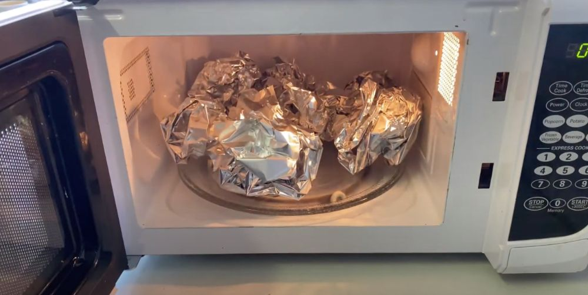

# Tinfoil
[](https://discord.gg/CXhCTscDfc)

> **Warning**: Tinfoil is in <ins>alpha</ins>. This means that not all of the Discord API is currently supported. It is recommended against using Tinfoil currently, as breaking changes are frequent.

## About
Tinfoil is a small and lightweight wrapper for Discord's REST and Gateway API, written in Typescript and designed with scalability in mind. It leaves a lot of stuff up to the user, allowing for more fine-tuned control over how your bot interacts with the API. It is best to think of Tinfoil more like a general utilities library for working with Discord's API, rather than a feature-complete library such as [discord.js](https://discord.js.org).

This was originally built for internal use at [combobot](https://discord.gg/J3rYDmbjU4), and currently powers our Gateway proxy.

**[Documentation Site](https://example.com)**

## Getting Started
You can install Tinfoil with one of the commands below, depending on what package manager you are using:
```
// Install commmands coming soon
```

A simple bot example:
```ts
import { Client } from "tinfoil";

const bot = new Client(process.env.BOT_TOKEN as string);
console.log(await bot.users.me.get()) // Logs bot information
```

## Scaling

Tinfoil provides APIs to easily control scaling for sharded bots, including cluster management, global app state management, easy shard-to-shard communication, and additional utility functions. You can bring your own cluster technology, whether that be simple child processes or a large Kubernetes network.

You can define your cluster manager with the `ShardNetworkManager` class. The cluster manager lets you define what happens when your application needs to add or remove shards (it spawns a child process by default). You can hook a `ShardNetworkManager` to your `Client` class when constructing your bot client.

Examples of implementing scaling with Tinfoil:
```ts
// Examples coming soon
```

## Contributing

Please open an issue with any bug reports, or a pull request to merge something you worked on.
